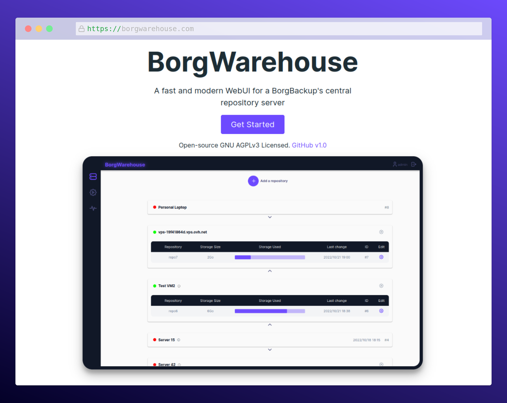

[![Next][Next.js]][Next-url]
[![React][React.js]][React-url]

  <h3 align="center">BorgWarehouse</h3>

  

    A fast and modern WebUI for a BorgBackup's central repository server.
     
    <a href="https://borgwarehouse.com"><strong>Explore the docs »</strong></a>
  

  

## ⭐ Support the Project

If you find BorgWarehouse helpful or interesting, please consider **giving it a star on GitHub** and **[sponsoring](https://github.com/sponsors/Ravinou)**. Your support is greatly appreciated!

## ✨ What is BorgWarehouse ?

**BorgWarehouse is a graphical interface to manage a central [BorgBackup](https://borgbackup.readthedocs.io/en/stable/#what-is-borgbackup) repository server.**

Today, if you want to have a large server on which you centralize backups of BorgBackup clients you have to do everything manually from the command line. It works, but in everyday life it can be complicated and adding, modifying, deleting repositories is always a bit long and tedious. If you want to do things right, you have to create a user on your server, associate him a public SSH key, give him a quota... in short **it's a bit of work**.

With BorgWarehouse, you have an interface that allows you to do all this simply and quickly :

-   **add** repositories
-   **edit** existing repositories
-   **delete** repositories
-   be **alerted** if there are no recent backups
-   **monitor** the volume of data
-   **flexibly manage quotas** for each repository
-   ...

The whole system part is automatically managed by BorgWarehouse and **you don't have to touch your terminal anymore** while enjoying a visual feedback on the status of your repositories.

## 📖 Get started

You can find the documentation here : [borgwarehouse.com](https://borgwarehouse.com/docs/prologue/introduction/)

## 🔑 Environment Variables

To run this project, you will need to add some environment variables.

You will find a complete documentation for this [here](https://borgwarehouse.com/docs/admin-manual/env-vars/).

## ⏬ How to update ?

Check the online documentation [just here](https://borgwarehouse.com/docs/admin-manual/how-to-update/) !

<!-- MARKDOWN LINKS & IMAGES -->
<!-- https://www.markdownguide.org/basic-syntax/#reference-style-links -->

## ❤️ Special thanks to sponsors ❤️

[next.js]: https://img.shields.io/badge/next.js-000000?style=for-the-badge&logo=nextdotjs&logoColor=white
[next-url]: https://nextjs.org/
[react.js]: https://img.shields.io/badge/React-20232A?style=for-the-badge&logo=react&logoColor=61DAFB
[react-url]: https://reactjs.org/
