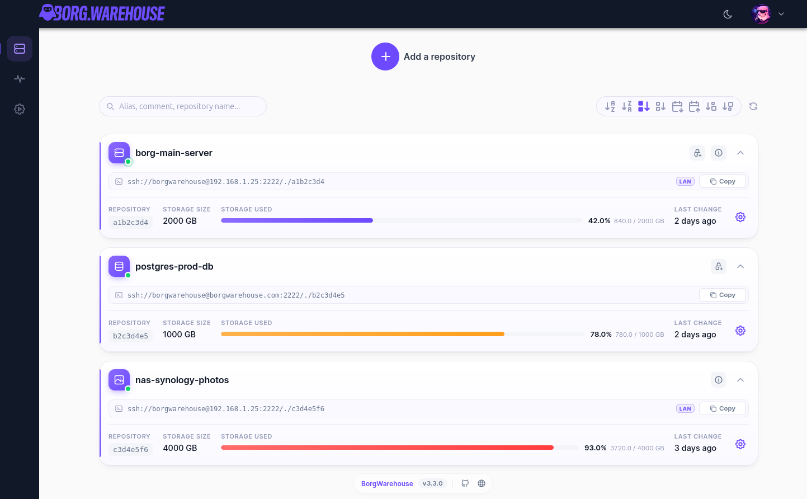

  

  <p align="center">
    A fast and modern WebUI for a BorgBackup's central repository server.
    <br />
    <a href="https://borgwarehouse.com"><strong>Explore the docs »</strong></a>
  </p>
  
<div align="center">

[](https://hub.docker.com/r/borgwarehouse/borgwarehouse)
[](https://github.com/Ravinou/borgwarehouse/releases)
[](https://github.com/Ravinou/borgwarehouse/stargazers)

</div>

<div align="center">
  <a href="https://borgwarehouse.com">
    <picture>
      <source media="(prefers-color-scheme: dark)" srcset="medias/borgwarehouse-og-dark.png">
      <source media="(prefers-color-scheme: light)" srcset="medias/borgwarehouse-og-light.png">
      
    </picture>
  </a>
</div>

## ⭐ Support the Project

<div align="center">
<a href="https://github.com/sponsors/Ravinou"></a>
<a href="https://liberapay.com/R4VEN/"></a>
</div>

If you find BorgWarehouse helpful or interesting, please consider **giving it a star on GitHub** and **[sponsoring](https://github.com/sponsors/Ravinou)**. Your support is greatly appreciated!

## ✨ What is BorgWarehouse ?

**BorgWarehouse is a graphical interface to manage a central [BorgBackup](https://borgbackup.readthedocs.io/en/stable/#what-is-borgbackup) repository server.**

Running a central BorgBackup server usually means doing _everything_ by hand from the command line: create a system user, attach an SSH key, set a quota, carve out storage… Adding, editing or removing a repository quickly becomes long and tedious.

**BorgWarehouse does all of that for you.** Create a repository in a few clicks, hand the ready-to-use SSH command to your client, and get a clear visual feedback on the health of every backup - **without ever touching your terminal again.**

## 🚀 Features

### 🗄️ Repository management

- **Add, edit and delete** Borg repositories from a clean web UI - the whole system layer (user, SSH, quota) is handled automatically
- **Per-repository storage quotas**
- **Per-repository external storage** - store each repository on the mounted storage of your choice (SSHFS, NFS, SMB/CIFS, a dedicated disk, an `rclone` mount…), selectable from the UI at creation time, with a live reachability check
- **Append-only mode** to protect your backups against ransomware or a compromised client
- **Custom icon per repository** to spot them at a glance
- **Ready-to-paste SSH commands** for your clients, with an optional **LAN variant**
- **Protection against repository deletion**
- ... many more !

### 📊 Monitoring & alerts

- **Real-time status** for each repository (healthy / down)
- **Monitoring dashboard**
- **"No recent backup" alerts** based on a per-repository threshold

### 🔔 Notifications

- **Email** (SMTP)
- **[Apprise](https://github.com/caronc/apprise)** - push alerts to 100+ services (Discord, Telegram, Slack, Gotify, ntfy…)
- **Webhooks** - with an optional custom secret header for payload validation

### 🔐 Authentication & security

- Local accounts **and SSO via OAuth / OIDC**: **GitHub, Google, Microsoft, GitLab** or any **generic OIDC** provider
- **Account linking** with an existing local account
- Optional **password-login disable** mode (SSO-only)
- **First-run setup wizard** (no default credentials)
- **Admin tool to reset a password or revoke sessions**

### 🎨 Modern UI/UX

- **Light & dark mode** 🌙
- **Responsive** design
- **Instant search, sorting and filtering** of your repositories
- **Setup wizard** to onboard your Borg clients step by step

### 🧩 Automation & API

- A full, **versioned and idempotent REST API** to manage everything programmatically
- Packaged as a single **Docker** image

## 🔒 Privacy by design

BorgWarehouse manages the **server side** of your Borg setup (repositories, users, SSH access, quotas and monitoring) and is **not meant to take over client-side responsibilities**. **It never asks for, stores, or has access to your repository passphrase.**

Your backups are **end-to-end encrypted on your client**, before they ever reach the server. BorgWarehouse can never read, decrypt or browse their content - and **it never will**. This is a deliberate boundary of the project: **any feature that would require your passphrase will simply never be built.**

## 📖 Get started

```bash
curl -fsSL https://raw.githubusercontent.com/Ravinou/borgwarehouse/main/docker/install.sh | bash
```

Full documentation : [borgwarehouse.com](https://borgwarehouse.com/docs/prologue/introduction/)

<!-- MARKDOWN LINKS & IMAGES -->
<!-- https://www.markdownguide.org/basic-syntax/#reference-style-links -->

## ❤️ Special thanks to sponsors ❤️

### 🥇 Current sponsors 🥇

<a href="https://github.com/royalmoose"></a>
<a href="https://github.com/dhenry123"></a>
<a href="https://github.com/fphammerle"></a>
<a href="https://github.com/MacH59-cos"></a>
<a href="https://github.com/shrippen"></a>
<a href="https://github.com/daschmidt1994"></a>
<a href="https://github.com/katekyonni"></a>

#### Past sponsors

<a href="https://github.com/Drallibor"></a>
<a href="https://github.com/shad-lp"></a>
<a href="https://github.com/Magneticdud"></a>
